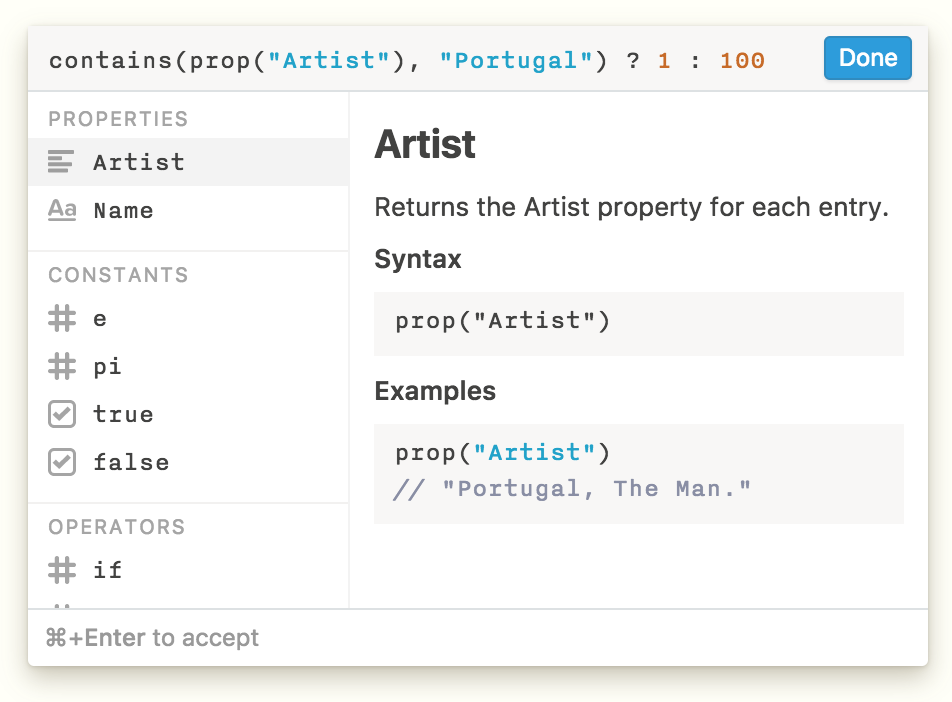
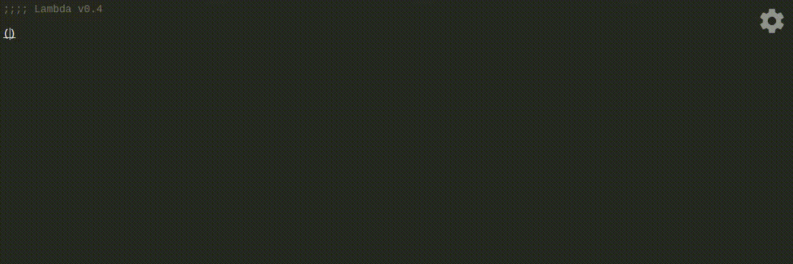

<section>

## Present

In 2018 I joined [Protocol Labs](https://protocol.ai) as an independent research scientist.

</section>

<section>

## Past

In summer 2017 I interned at [Notion](https://notion.so), writing a DSL and designing an editor for querying and computing over relational data. {}{}

In summer 2016 I started working with Gerry Sussman and Jack Wisdom to redesign the online notes for 6.946: Computational Classical Mechanics. Along the way I prototyped a visual, symbolic Scheme programming environment for the browser and wrote a [native Jupyter kernel](github.com/joeltg/mit-scheme-kernel) for MIT Scheme that I still maintain.

<figure>

</figure>

Before that, I worked in the Viral Communications Group at the Media Lab as an undergraduate researcher.

</section>
